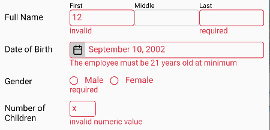
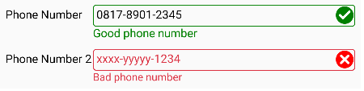

# **react-native-form-input-validator**

It's to validate the input's value in RN app such as `TextInput` or other kind of inputs. The value is validated based on the rule defined for the input.
If the input is invalid, the error message is shown beneath the input. It's very useful before submitted to the server. See the pictures below for some
examples.     

  

More fancy example which uses an icon to reflect the validation status:



### **A Brief Example** <a name="brief_example"></a>
```javascript
import React from 'react';
import {
    Button,
    StyleSheet,
    Text,
    TextInput,
    View,
} from 'react-native';
import {
    setStatusStyleDefault,
    ValidationContext,
    withValidation,
} from "react-native-form-input-validator";
import {
    email,
    required,
} from 'react-native-form-input-validator/rules';
import server from './server';

const UserName = withValidation(TextInput, {
    rules: [email, required],
    setStatusStyle: setStatusStyleDefault,
});
const Password = withValidation(TextInput, {
    rules: required,
    setStatusStyle: setStatusStyleDefault,
});

export default function LoginForm() {
    const validationRef = React.createRef();
    const [userName, setUserName] = React.useState('');
    const [password, setPassword] = React.useState('');
    
    return (
        <ValidationContext ref={validationRef}>
            <Text style={styles.title}>Please login:</Text>
            <UserName autoCorrect={false} onChangeText={setUserName} placeholder="Email" style={styles.input} value={userName} />
            <Password onChangeText={setPassword} placeholder="Password" secureTextEntry style={styles.input} value={password} />
            <View style={styles.buttonRow}>
                <Button
                    onPress={() => {
                        if (validationRef.current?.validate()) {
                            server.login(userName, password);
                        }
                    }}
                    title="Login"
                />
            </View>
        </ValidationContext>
    );
}

const styles = StyleSheet.create({
    buttonRow: {
        flexDirection: 'row',
        justifyContent: 'flex-end',
    },
    input: {
        borderColor: '#ccc',
        borderRadius: 4,
        borderWidth: 1,
        color: 'black',
        marginBottom: 10,
    },
    title: {
        marginBottom: 10,
    },
});
```

# **API Reference**
You have seen the example above. You may concern to `withValidation` and `ValidationContext` most. At a glance, you may have concluded
that `withValidation` is to specify the validation rules for the input and `ValidationContext` is to validate all inputs inside it.
Actually, each input can be validated individually and doesn't need to be put inside `ValidationContext` (see detailly
[here](#user-content-withvalidation_method-validate)). `ValidationContext` exists to validate many input at once.


## **`ValidationContext`** <a name="ValidationContext"></a>

This element can validate all contained inputs in it that have been set by [`withValidation`](#user-content-withvalidation). Also, it can clear the validation
status of those inputs. You may treat this element like `form` tag in HTML document. Some properties that can be set for this element are:
<a name="ValidationContext-properties"></a>
<table>
<tr>
    <th>Name</th>
    <th>Data Type</th>
    <th>Description</th>
    <th>Default value</th>
</tr>
<tr>
    <td valign="top"><code>auto</code><a name="ValidationContext-auto"></a></td>
    <td valign="top"><code>boolean</code></td>
    <td valign="top">If <code>true</code> then all inputs inside it will be validated automatically when the user types/changes the input value.</td>
    <td valign="top"><code>false</code></td>
</tr>
<tr>
    <td valign="top"><code>errorTextStyle</code><a name="ValidationContext-errorTextStyle"></a></td>
    <td valign="top"><code>Text</code> style property</td>
    <td valign="top">The style for the error message when the input is invalid.</td>
    <td valign="top">gives red color to the text</td>
</tr>
<tr>
    <td valign="top"><code>focusOnInvalid</code><a name="ValidationContext-focusOnInvalid"></a></td>
    <td valign="top"><code>boolean</code></td>
    <td valign="top">If <code>true</code> then after validation, the first invalid input which has <code>focus</code> method will get the
    focus.</td>
    <td valign="top"><code>false</code></td>
</tr>
<tr>
    <td valign="top"><code>inputErrorStyle</code><a name="ValidationContext-inputErrorStyle"></a></td>
    <td valign="top">input style property</td>
    <td valign="top">The style for the input when the input is invalid.</td>
    <td valign="top">gives red color to the border and text</td>
</tr>
<tr>
    <td valign="top"><code>lang</code><a name="ValidationContext-lang"></a></td>
    <td valign="top"><code>function(string): string</code></td>
    <td valign="top">This function is useful for the app whose multi language. This function is to translate the error messages which are in
        english to the active language. Read <a href="#messages">this section</a> to inquire what messages need to translate.</td>
    <td valign="top"><code>s => s</code><br/>
        It means no translation.
    </td>
</tr>
</table>

#### **Methods of `ValidationContext` reference (the object that we get from `ref` property):**
- `clearValidation` <a name="ValidationContext_method-clearValidation"></a>   
  It executes [`clearValidation`](#withValidation_method-clearValidation) method of all contained inputs to clear the validation
  status of all contained inputs.

- `refreshMessage`   
  For a multi languange app, this method is useful to update the language of the error messages. This methods will re-validate
  all contained inputs so that their error messages are refreshed. Because of that, if the input is already valid then the error
  message will be gone.

- `validate` <a name="ValidationContext_method-validate"></a>   
  It executes [`validate`](#withValidation_method-validate) method of all contained inputs to validate all contained inputs. This method
  returns `false` if any invalid input and returns `true` otherwise.


## **`withValidation`** <a name="withValidation"></a>

This function is to create *higher-order component* that wraps an input component so that it can apply some validation rules and also
some attributes needed to define the behavior. You can see in the [example](#brief_example) above that this function takes two parameters.
The first parameter is the function/class component that will be validated. The second parameter is the option object. The object has
properties which specify validation rules and the other attributes. But if you only need to set the validation rule(s) for the input, the
second parameter can a [rule](#rule) object or an array of [rule](#rule) objects.

I think the [example](#brief_example) above is enough to depict how to use this function. So, in this section, we will discuss the option
properties more detailedly. The only property you must specify is `rules`. <a name="withValidation-option-properties"></a>
<table>
<tr>
    <th>Name</th>
    <th>Data Type</th>
    <th>Description</th>
    <th>Default value</th>
</tr>
<tr>
    <td valign="top"><code>auto</code><a name="withValidation-auto"></a></td>
    <td valign="top"><code>boolean</code></td>
    <td valign="top">If <code>true</code> then the input will be validated automatically when the user types/changes the input value.
        If specified, it will override the specified <a href="#ValidationContext-auto"><code>auto</code></a> for
        <code>ValidationContext</code>
    </td>
    <td valign="top">None (optional)</td>
</tr>
<tr>
    <td valign="top"><code>errorTextStyle</code><a name="withValidation-errorTextStyle"></a></td>
    <td valign="top"><code>Text</code> style property</td>
    <td valign="top">The style for the error message when the input is invalid. If specified, it will overwrite the specified
        <a href="#ValidationContext-errorTextStyle"><code>errorTextStyle</code></a> for <code>ValidationContext</code>.
    </td>
    <td valign="top">None (optional)</td>
</tr>
<tr>
    <td valign="top"><code>getStyle</code><a name="withValidation-getStyle"></a></td>
    <td valign="top"><code>function(props): style</code></td>
    <td valign="top">This function is to get the style specified for the input. The function will be given the <code>props</code> object of
        input as the parameter and it must return the value of property which defines the style. Usually, the property name is
        <code>style</code>. If the input is a composite component, the returned value must be the style for the root element of input.
        For example, below is an input which consists of the composite component:
<pre>
function PercentageInput({
    containerStyle,
    inputStyle,
    percentStyle,
    ...props
}) {
    return &lt;View
        style={[
            containerStyle,
            {flexDirection:'row'}
        ]}
    &gt;
        &lt;TextInput
            style={inputStyle}
            {...props}
        /&gt;
        &lt;Text style={percentStyle}&gt;%&lt;/Text&gt;
    &lt;/View&gt;;
}
</pre>
        <code>getStyle</code> must return <code>containerStyle</code> for above input.<br/>
        Read this <a href="#style_handling">section</a> why this function needed.
    </td>
    <td valign="top" nowrap><code>props => props.style</code></td>
</tr>
<tr>
    <td valign="top"><code>getValue</code><a name="withValidation-getValue"></a></td>
    <td valign="top"><code>function(props): any</code></td>
    <td valign="top">This function is to get the value of the input. The function will be given the <code>props</code> object of input
        as the parameter and it must return the value of property which stores the input value. You really have to specify this function
        if the input value is not stored in the property named <code>value</code>. If not, the validation won't work.
    </td>
    <td valign="top" nowrap><code>props => props.value</code></td>
</tr>
<tr>
    <td valign="top"><code>inputErrorStyle</code><a name="withValidation-inputErrorStyle"></a></td>
    <td valign="top">input style property</td>
    <td valign="top">The style for the input when the input is invalid. It overwrites
        <a href="#ValidationContext-inputErrorStyle"><code>inputErrorStyle</code></a> of <code>ValidationContext</code>. You must also
        specify <a href="#withValidation-setStatusStyle">setStatusStyle</a> to make the input changes its style.
    </td>
    <td valign="top">None (optional)</td>
</tr>
<tr>
    <td valign="top"><code>lang</code><a name="withValidation-lang"></a></td>
    <td valign="top"><code>function(string): string</code></td>
    <td valign="top">It's the same as <a href="#ValidationContext-lang"><code>lang</code></a> property of <code>ValidationContext</code>.
        It's only used if the input is placed not inside <code>ValidationContext</code>. So, it won't override what is specified for
        <code>ValidationContext</code>
    </td>
    <td valign="top">None (optional)</td>
</tr>
<tr>
    <td valign="top"><code>name</code><a name="withValidation-name"></a></td>
    <td valign="top"><code>string</code></td>
    <td valign="top">The name for the input. It's useful if you want to show the name in the error message. Read
        <a href="#messages">Messages</a> section and <a href="#function-str"><code>str</code></a> for more information.
    </td>
    <td valign="top">None (optional)</td>
</tr>
<tr>
    <td valign="top"><code>rules</code><a name="withValidation-rules"></a></td>
    <td valign="top"><a href="#rule">rule</a> object or array of <a href="#rule">rule</a> objects</td>
    <td valign="top">It's the validation <a href="#rule">rules</a>. You must specify it. If not, the input component will be unmodified.</td>
    <td valign="top">None (required).</td>
</tr>
<tr>
    <td valign="top"><code>setStatusStyle</code><a name="withValidation-setStatusStyle"></a></td>
    <td valign="top"><code>function(props, style, context): React.Node</code></td>
    <td valign="top">This function is called when executing <a href="#withValidation_method-validate"><code>validate</code></a>.
        This function should change the input style to reflect the validation status (valid/invalid). This function also is executed
        in every render because the style is reverted to normal style by <a href="#withValidation-setStyle"><code>setStyle</code></a>
        function. In which condition the function is executed, you can check the second parameter.<br/>
        <b>Parameters:</b>
        <ul>
            <li><code>props</code> is the properties of input. The property you should care about is that which holds holds style value
                for the input, usullly named <code>style</code>.</li>
            <li><code>style</code> is the style value that should be assigned to the input style property. When invalid, this parameter
                is array of two entries, the first is <a href="#ValidationContext-inputErrorStyle"><code>inputErrorStyle</code></a> of
                <code>ValidationContext</code> and the second is <a href="#withValidation-inputErrorStyle"><code>inputErrorStyle</code></a>
                option. You may ignore this value if you have your own way to set the style.<br/><br/>
                When the input is valid, this parameter has the falsy value. There are three possibilities of this falsy value:
                <ul>
                    <li><code>undefined</code> if valid when executing <a href="#withValidation_method-validate"><code>validate</code></a>.
                        You may set a success style to the input such as decorating it with green border.
                    </li>
                    <li><code>null</code> if when executing <a href="#withValidation_method-clearValidation"><code>clearValidation</code></a>.
                        Because of being cleared, you should not set any status style (valid/invalid). The style should be reverted
                        to normal.
                    </li>
                    <li><code>false</code> if when rendering process.</li>
                </ul><br/>
                The better comprehension may you get from <a href="#function-setStatusStyleDefault"><code>setStatusStyleDefault</code></a>
                and this <a href="https://github.com/atmulyana/react-native-form-input-validator/blob/main/example/StatusIconPage.js">example</a>.
            </li>
            <li><code>context</code> is an object which has <code>flag</code> property and <code>clearValidation</code> method.
                See this <a href="https://github.com/atmulyana/react-native-form-input-validator/blob/main/example/StatusIconPage.js">example</a>
                how to use it.
            </li>
        </ul>
        <b>Return Value</b><br/>
        This function may return <code>React.Node</code>. The <code>React.Node</code> may display an icon which represents valid/invalid.
        The icon will placed beneath the input and above the error message. But, by using absolute positioning, you can place the icon at
        left/right side of input. See this
        <a href="https://github.com/atmulyana/react-native-form-input-validator/blob/main/example/StatusIconPage.js">example</a>.
    </td>
    <td valign="top">None (optional).<br/>
        You may use <a href="#function-setStatusStyleDefault"><code>setStatusStyleDefault</code></a> as in the
        <a href="#brief_example">example</a> above.
    </td>
</tr>
<tr>
    <td valign="top"><code>setStyle</code><a name="withValidation-setStyle"></a></td>
    <td valign="top"><code>function(props, style, containerStyle)</code></td>
    <td valign="top">This function is opposite of <a href="#withValidation-getStyle"><code>getStyle</code></a>. The third parameter is
        the style for <code>View</code> container (read this <a href="#style_handling">section</a> for more information). This third
        parameter is useful in the case that you want to modify it. Because <code>setStyle</code> is invoked in every render, just
        make sure it won't mess up the layout/appearance when executed more than once. 
    </td>
    <td valign="top"><nobr><code>(props, style) =></code></nobr><br/> <nobr><code>props.style = style</code></nobr></td>
</tr>
</table>

#### **Methods and property of the input reference (the object that we get from `ref` property):** <a name="withValidation_methods_property"></a>
- `clearValidation` <a name="withValidation_method-clearValidation"></a>   
  It's to clear validation status. The error message will disappear and the input style is reverted to normal. After executing this
  method, [`isValid`](#withValidation_property-isValid) will be reset to `true` even if the input is invalid. If
  [`auto`](#withValidation-auto) validation is disabled, this method will be called when the user changes the input value right after
  the validation.

- `isValid` <a name="withValidation_property-isValid"></a>  
  It shows the validation status of input. It's `true` if valid and `false` if invalid. The value of this property is trusted after
  calling [`validate`](#withValidation_method-validate).

- `validate` <a name="withValidation_method-validate"></a>  
  This method is to validate the input based on the specified [rules](#withValidation-rules). Below is the example how to validate input
  when it's lost focus.   

    `<NameTextInput ref={nameInput} onBlur={() => nameInput.current?.validate()} onChangeText={setName} value={name} />`

If the original input has the same methods and property as listed above, they will be overriden. If you want to invoke the overridden
method/property of original input, follow the example below:

    const inputRef = React.useRef();
    ...
    <Input ref={inputRef} onBlur={() => {
        //This statement will validate the input
        inputRef.current.validate();
        
        //This statement will invoke `validate` method of original input
        Object.getPrototypeOf(inputRef.current).validate();
    }} ... />


## Style Handling <a name="style_handling"></a>

To make the input and the error message stick together, [`withValidation`](#withValidation) wraps them into a `View` container. However,
we want the component yielded by [`withValidation`](#withValidation) behaves the same as the original input except we add the validation
feature to it. All properties for the input must apply for the new component. Every property seems ok, we can just distribute them to the
wrapped input. Except one property we think it has a problem. That is the property which defines the style for the input. Because now, the
input is inside a `View` container. We must modify the style property if we still want the same style as if the input is unwrapped. The
big concern is all style attributes dealing with layout. That is how the parent of input arranges the area for input, before. Because now,
the parent must arrange the `View` container. Therefore, the component yielded by [`withValidation`](#withValidation) will move all style
attributes dealing with layout to be the style attributes of `View` container. Then, the input mus be set to fill the area of `View`
container.

We know, the value for style property is not always plain object or a falsy value but it can be a recursive array. Therefore, the first
step is to flatten it if it's an array. Fortunately, react native has provided `StyleSheet.flatten` function to do that. After getting
a single plain object, the following style attributes will be assigned to `View` container:
- `alignSelf`
- `bottom`
- `display`
- `end`
- `flexGrow`
- `flexShrink`
- `flexBasis`
- `left`
- `margin`
- `marginBottom`
- `marginEnd`
- `marginHorizontal`
- `marginLeft`
- `marginRight`
- `marginStart`
- `marginTop`
- `marginVertical`
- `maxWidth`
- `minWidth`
- `position`
- `right`
- `start`
- `top`
- `transform`
- `width`
- `zIndex`

Some other attributes will be moved to `View` containner under a condition:
- `height`, `minHeight` and `maxHeight`, if having the percentage value
- `flex`, if greater than 0.

To make sure the input fill the area of `View` container, its `flex` attribute is set to 1 if the `View` container has one of 
attributes: `height` (percentage), `flex` or `flexBasis`. But if input has `height` (number) attribute, the `flex` attribute won't
be set.

There are two handlers you may define in `withValidtion` option which involves in this modification of style. Those are 
[`getStyle`](#withValidation-getStyle) and [`setStyle`](#withValidation-setStyle).

There is still a possibility that the layout will mess up when the error message comes up. That possibility happens, especially when
the parent of input (that becomes the parent of `View` container) lays its children horizontally (`flexDirection` is `row`). To
avoid it, you should set the height (not percentage) for the input.

The process explained above is executed in every render. To increase performance, it must be sure that the process is run only if
the style value changes. To do that, the package has `isDifferentStyle` function. You can import this function for your own purpose.
This function does more detailedly than a shallow compare. Let's explain in the example below:

    const style1 = {flex: 2},
          style2 = {flex: 3};
    isDifferentStyle(style1, style2); //return true
    isDifferentStyle(style1, [style1]); //return false
    isDifferentStyle([style1], [style1]); //return false
    isDifferentStyle([style1, style2], [style1, style2]); //return false
    isDifferentStyle([style1, style2], [style2, style1]); //return true
    isDifferentStyle(style1, [style2]); //return true
    isDifferentStyle([style1], [style1, style2]); //return true

So, the function simply just compares the entry in the array at the same index. The more detailedly logic can be done to make sure
that they are really different but it can cause a more complicated process that won't help increasing performance.

To help increasing performance, you must also set the style value to a contant value, not variable. For example:

    const styles = StyleSheet.create({
        input: {borderWidth: 1, ...},
        hightlight: {...},
    });
    const Input = withValidation(TextInput, ...);

    //It's BAD example
    <Input style={{borderWidth: 1, ...}} ... />

    //It's good
    <Input style={styles.input} ... />

    //If you want make a diiferent style for a condition, it's good example
    <Input style={[
        styles.input,
        highlighted ? styles.hightlight : null,
    ]} ... />


## **`Validation`** <a name="Validation"></a>

`Validation` component can be used to validate a value without wrapping an input component. It has some properties which are the same as
`withValidion` [option](#withValidation-option-properties). These properties are `auto`, `errorTextStyle`, `lang` and `rules`. The purpose
of these properties are exactly the same as `withValidion` option's. These properties are *write-once*. They are only set when the
component is mounted. If you change the properties in the next render, it won't have effect.

Beside the properties mentioned before, there are two more properties:
- `style` is the style for `View` rendered by `Validation` component.
- `value` is the validated value.

`Validation` object reference also has the same methods and property as [those](#withValidation_methods_property) owned by input component
reference resulted by `withValidation`

**Example:**

    import React from 'react';
    import {... TextInput, ...} from 'react-native';
    import {Validation, ValidationContext} from "react-native-form-input-validator";
    import {email, required} from 'react-native-form-input-validator/rules';
    ...

    export default function Form() {
        ...
        const [emailAddress, setEmailAddress] = React.useState('');
        ...

        return (
            <ValidationContext ref={validation}>
                ...
                <TextInput onChangeText={setEmailAddress} placeholder="Email" value={emailAddress} />
                <Validation rules={[required, email]} value={emailAddress} />
                ...
            </ValidationContext>
        );
    }

You notice this example, the value of `Validation` is the same as the value of email `TextInput`. By this way, it's like to apply the
use of `withValidation` to the email `TextInput`.


## **Functions** <a name="functions"></a>

The functions here can be imported from the package.

#### **`setStatusStyleDefault`** <a name="function-setStatusStyleDefault"></a>
This function is intended to be assigned to `withValidation` [`setStatusStyle`](#withValidation-setStatusStyle) option. This function
executes the common statements to set input style. Here is the source code which may inspire you to make your own.
```javascript
function setStatusStyleDefault(props, style) {
    /**
     * Need to remember: the input's style property has been flattened by `withValidation` function. So, normally,
     * it can't be an array.
     */
    let inputStyle = getStyleDefault(props);
    if (style) { //The input style needs to change
        if (Array.isArray(inputStyle)) {
            //The input has got the error/success style. Don't be double set so that it can be reverted to normal style easily
            if (style !== inputStyle[1]) {
                setStyleDefault(props, [inputStyle[0], style]);
            }
        }
        else {
            setStyleDefault(props, [inputStyle, style]);
        }
    }
    else //back to normal style 
        if (Array.isArray(inputStyle)) {
            setStyleDefault(props, inputStyle[0]);
        }
}
```

#### **`str(template, valueMap)`** <a name="function-str"></a>
This function is to construct a string from a template string and a map of values. In the template string contains the placeholders
for variables to be replaced by the real value. The placeholder is in format `${variable_name}`. The real values is in `valueMap`
parameter. For example:

    str('${name} must be at least ${min}', {name: 'count', min: 5})

will return string `"count must be at least 5"`.


## **Rule Object** <a name="rule"></a>

Rule object defines how to validate the input value. For example whether it's required (cannot be empty), must be a numeric value,
must be minimum at a certain value etc. The rule object is reponsible to check whether the input value meets the desired condition
or not, to be valid. Mostly, one rule object is responsible to check only one condition. Howerver, we can combine some rule objects
so that the input value must meet some conditions to be valid. This is why `withValidation` [rules](#withValidation-rules) option
can be a single rule object or an array of rule objects.

This package has some *built-in* rule objects which are ready to use. These rule objects are explained in the next sections.
You can create your own rule object by creating a class that extendes [`ValidationRule`](#ValidationRule). All rule objects are
imported from `'react-native-form-input-validator/rules'`.

### **`ValidationRule`** <a name="ValidationRule"></a>

This is the base class for all rule objects. Therefore, all object rules must have all properties and methods explained here. 

#### **Properties:** <a name="ValidationRule_properties"></a>
- `errorMessage` <a name="ValidationRule_property-errorMessage"></a>  
  Read-only. The error message if the input is invalid. If you define a new rule class, you should override this property to return
  the default error message. The value of this property can be a template string that can include some properties of the defined
  rule object. For example: `"${name} is invalid. ${value} is not valid phone number"`.

- `isValid` <a name="ValidationRule_property-isValid"></a>  
  It's `true` if valid and `false` if invalid. It's set by [`validate`](#ValidationRule_method-validate) method. Therefore, it's trusted
  just after calling [`validate`](#ValidationRule_method-validate) method.

- `lang`  
   is a function to translate the error message to the active languange. By default, the message is in english. It will be set by 
   [`validate`](#withValidation_method-validate) method of input ref that will be the same as context [`lang`](#ValidationContext-lang)
   or `widthValidation` [`lang`](#withValidation-lang) option.

- `messageFunc` <a name="ValidationRule_property-messageFunc"></a>  
  Read-only. It's a function which returns the error message. This error message overwrites the default message specified by
  [`errorMessage`](#ValidationRule_property-errorMessage). The parameter of the function is the rule object itself. To set this
  property, use [`setMessageFunc`](#ValidationRule_method-setMessageFunc) method.

- `name` <a name="ValidationRule_property-name"></a>  
  is the name of validated input. It's set by [`validate`](#withValidation_method-validate) method of input ref which is the same as
  `widthValidation` [`name`](#withValidation-name) option.

- `priority` <a name="ValidationRule_property-priority"></a>  
  Read-only. If we specify some rules to validate the input, `priority` determines which rule to be examined first. `priority` has a
  number value. The lower value means the higher priority. By existence of `priority`, you don't need to bother the order in
  [`rules`](#withValidation-rules) array of `withValidation` option. The value of this property is set by
  [`setPriority`](#ValidationRule_method-setPriority).

  By default, the *built-in* rules have the priority as following (ordered based on which is examined first):
  + `required`, `required.if` (the priority cannot be changed, always the highest)
  + `email`, `numeric`, `strlen`, `strlenmax`
  + `integer`
  + `max`, `min`
  + `regex`
  + `rule`

  If two rules have the same priority, the order in the [`rules`](#withValidation-rules) array determines which one first.

- `value` <a name="ValidationRule_property-value"></a>  
  is the input value that is validated. It's set by [`validate`](#withValidation_method-validate) method of input ref.

- `resultValue`  
  After calling [`validate`](#ValidationRule_method-validate), `resultValue` will save a value with valid data type. For example, for
  `numeric` rule, it will save a number value, not string like [`value`](#ValidationRule_property-value). By default, it's the same
  as [`value`](#ValidationRule_property-value) (with the same data type).

#### **Methods:** <a name="ValidationRule_methods"></a>
- `setMessageFunc` <a name="ValidationRule_method-setMessageFunc"></a>  
  is to set [`messageFunc`](#ValidationRule_property-messageFunc) property.

- `setName` <a name="ValidationRule_method-setName"></a>  
  is to set [`name`](#ValidationRule_property-name) propety.

- `setPriority` <a name="ValidationRule_method-setPriority"></a>  
  is to set [`setPriority`](#ValidationRule_property-priority). You should set a non-negative number.

- `setValue` <a name="ValidationRule_method-setValue"></a>  
  is to set [`value`](#alidationRule_property-value) property.

- `validate` <a name="ValidationRule_method-validate"></a>  
  is to validate [`value`](#ValidationRule_property-value) and then set [`isValid`](#ValidationRule_property-isValid) based on the
  validity of [`value`](#ValidationRule_property-value).

You may ask why there are some `set*` method, why don't leave *read-write* property alone. It is to make *fluent interface* which
is more convenient. For example, when you set rule for `withValidation` [`rules`](#withValidation-rules) option:

    const Input = withValidation(..., {
        ...
        rules: [
            numeric,
            integer,
            min(0).setPriority(5),
            max(4).setMessageFunc(() => 'Too many'),
        ],
        ...
    });

or in unit test:

    expect(email.setValue('abc').validate().isValid).toBe(false);

#### **Example:**
An example class which you may create to validate a credit card number:
```javascript
import {ValidationRule} from 'react-native-form-input-validator/rules';
const validator = require("card-validator");

export class CreditCardNumber extends ValidationRule {
    contructor() {
        super();
        this.setPriority(0); //0 is default, but here if you want to set the priority
    }

    get errorMessage() {
        return this.lang('invalid credit card number');
    }

    validate(): Rule<string> {
        this.isValid = validator.number(this.value).isValid;
        return this;
    }
}

const ccNumber = new CreditCardNumber(); //`ccNumber` is more convienent to write than `new CreditCardNumber()`
```

### **`new Email()` or `email`** <a name="email"></a>
The rule for examined the input value whether it's a valid email address or not.

### **`new Integer()` or `integer`** <a name="email"></a>
Checks if the input value is integer or not. If the input value is a string (such as getting from `TextInput`) and you want
it considered as number, you must also specify [`numeric`](#numeric) rule for the input. The `numeric` rule must have higher
[`priority`](#ValidationRule_property-priority) (default).

### **`new Max(maxValue)` or `max(maxValue)`** <a name="max"></a>
To limit the input value at maximum of `maxValue`. The data type of `maxValue` can be string, number or `Date`. If `maxValue`
is number but the input value is string (such as getting from `TextInput`) then you must also specify [`numeric`](#numeric) rule
for the input. The `numeric` rule must have higher [`priority`](#ValidationRule_property-priority) (default).

### **`new Min(minValue)` or `min(minValue)`** <a name="min"></a>
To limit the input value at minimum of `minValue`. The data type of `minValue` can be string, number or `Date`. If `minValue`
is number but the input value is string (such as getting from `TextInput`) then you must also specify [`numeric`](#numeric) rule
for the input. The `numeric` rule must have higher [`priority`](#ValidationRule_property-priority) (default).

### **`new Numeric()` or `numeric`** <a name="numeric"></a>
To assess if the input value is numeric or not.

### **`new Regex(pattern, flags)` or `regex(pattern, flags)`** <a name="regex"></a>
To examine if `pattern` applies to the input value. `pattern` can be a `RegExp` object or a pattern string. If `pattern` is a
string, `flags` parameter is the flags to add to the pattern (see
[this doc](https://developer.mozilla.org/en-US/docs/Web/JavaScript/Reference/Global_Objects/RegExp/RegExp) for more information). 

### **`new Required()` or `required`** <a name="required"></a>
It's to specify the input value cannot be empty. This rule is the highest priority, examined at the first time. If this rule is
not specified then the input is optional. If optional then when the input is not filled, it's assessed as valid, the other rules
that has been specified won't be examined.

### **`new Required.If(predicate)` or `required.if(predicate)`** <a name="required.if"></a>
It's the same as [`required`](#required) rule but under a condition. The `predicate` parameter is a function. If it returns `true` 
then the input is required. Otherwise, it's optional. The parameter of `predicate` function is the input value.

### **`new CustomRule(predicate, errorMessage)` or `rule(predicate, errorMessage)`** <a name="rule"></a>
If you need more complicated logic to assess whether the input value is valid or invalid, this rule fits for it. The `predicate`
parameter is a function to asses the input value. The parameter of this function is the input value. The `predicate` function
may return `boolean` (`true` is valid, `false` is invalid) or a string. If it returns a string then the input is considered as
invalid. The returned string is the error message (by this way, you may create different error message for different condition).
The `errorMessage` parameter is used as the error message if `predicate` function doesn't return a string (returns `false`).
If you set [`messageFunc`](#ValidationRule_property-messageFunc) then the error message will be taken from `messageFunc`.

### **`new StrLength(minValue, maxValue)` or `strlen(minValue, maxValue)` or `strlenmax(maxValue)`** <a name="strlen"></a>
After the input value is converted to string, this rule is to limit the length of the value string. The minimum length is
specified by `minValue` parameter and the maximum length is specified by `maxValue` parameter. If `minValue` is undefined then
the minimum length is 0. If `maxValue` is undefined then no limit for maximum length.


## **Messages** <a name="messages"></a>

Each *built-in* [rule object](#rule) has default error message. All messages are collected in one object. You must inspect 
them in the case that you want to translate them to the other languages. The messages can be found in `messages.js`. The
messages are listed in the following code:
```javascript
{
    email: 'invalid email address',
    integer: 'must be the round number',
    invalid: 'invalid',
    max: 'maximum ${max}',
    min: 'minimum ${min}',
    numeric: 'invalid numeric value',
    required: 'required',
    strlenmax: "don't exceed ${max} characters",
    strlenmin: 'must be at least ${min} characters',
}
```

These default messages can be changed that will affect the whole app. For example, you want to change 'required' message to
be 'must be filled'. To do that, insert some codes into `index.js` in the root directory of app like the following:
<pre>
    import {AppRegistry} from 'react-native';
    import App from './App';
    import {name as appName} from './app.json';

    <b style="background-color:yellow">import messages from 'react-native-form-input-validator/messages';</b>
    <b style="background-color:yellow">messages.required = 'must be filled';</b>

    AppRegistry.registerComponent(appName, () => App);
</pre>
The lines which have bold font are the inserted code.

If you read the message for `max` or `min` rule, you find the special words `${max}` and `${min}`. They are the variable placeholder
that will be replaced by the real value. The error message will be processed by [`str`](#function-str) function. The second parameter
for the function is the examined rule object. Therefore, the variable name in the template string is the property name of the rule
object. For example, in the example before, you want to display the input name in the message. You must change the second bold line
to be

    messages.required = '${name} must be filled';

To make it works, you must also to set the input name in `withValidation` [name](#withValidation-name) option.


## **Example App** <a name="messages"></a>

There is an example app you can find [here](https://github.com/atmulyana/react-native-form-input-validator/blob/main/example/)
